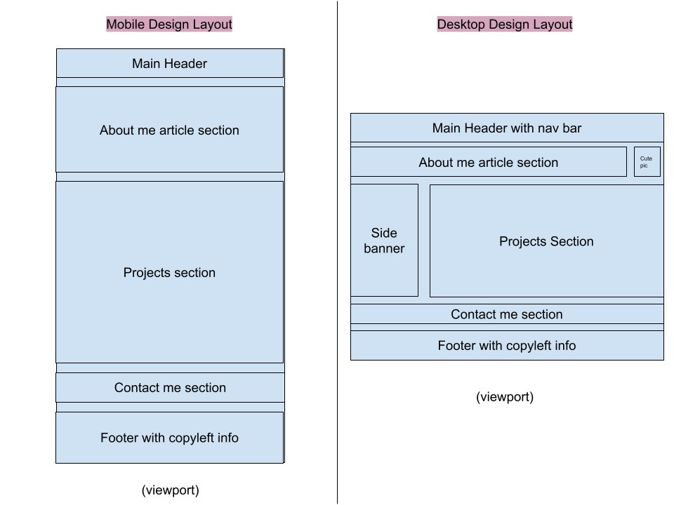

# Portfolio
Gunnar's portfolio of current projects! :)

## About this project
This is the project to host my project portfolio.

This was created under my time in the Univerity of Minnesota Full Stack Coding Bootcamp. Currently it is just using html and CSS, but it will be updated as I progress.

Feel free to access the project [here!](https://fixedotter.github.io/portfolio/)

## Project Criteria
```
I need an employer to be able to sample my previous work
When they load my portfolio:
  They am presented with my name name, a recent photo or avatar, and links to sections about myself, my work, and how to contact me.
When they click one of the links in the navigation
  The UI scrolls to the corresponding section
When they click on the link to the section about my work
  The UI scrolls to a section with titled images of my applications
When they are presented with my first application
  That application's image should be larger in size than the others
When they click on the images of the applications
  They am taken to that deployed application
When they resize the page or view the site on various screens and devices
  They am presented with a responsive layout that adapts to my viewport
```

## Project Mocked-up Wireframe



## Actual Site Screenshot


